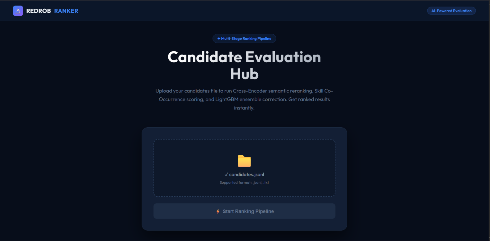
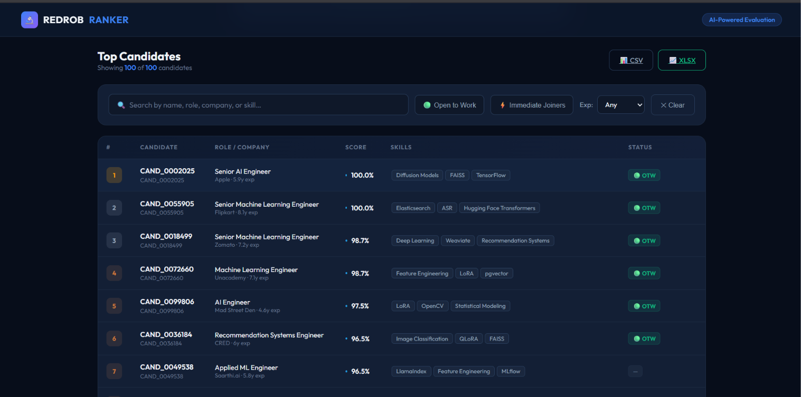
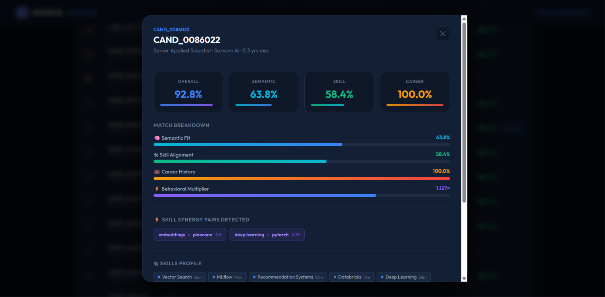
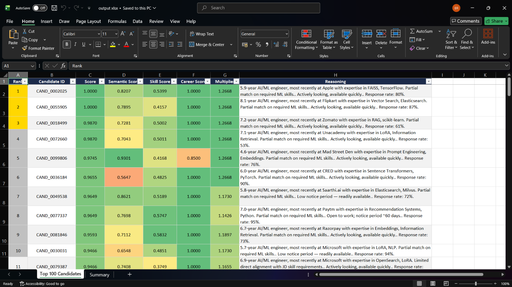

# Redrob Intelligent Candidate Discovery & Ranking System

> **Redrob Data & AI Challenge Submission**  
> An advanced, production-grade candidate matching and ranking pipeline powered by custom semantic embeddings, logical fraud detection, cross-encoder neural reranking, LightGBM non-linear correction, and a premium dark-mode web interface.
> 
> 🌐 **Live Web Application**: [redrob-candidate-ranker.onrender.com](https://redrob-candidate-ranker.onrender.com/)

---

## 🖥️ Web App & Interactive Dashboard

The submission includes a full Flask-based web application providing a premium dark-mode interface for uploading candidate datasets, tracking execution progress in real-time, filtering results, and exploring matching profiles.

### 📸 Dashboard Screenshots & System Interface

#### 1. File Upload & Pipeline Initialization
Drag-and-drop interface supporting large candidate `.jsonl` and `.json` datasets with real-time status and console logging.


#### 2. Interactive Matching & Scoring Dashboard
Detailed data table showing top ranked candidates, real-time search, filters for "Open to Work", "Immediate Joiners", and Experience slider.


#### 3. Deep-Dive Candidate Profile Modal
Clicking on any candidate displays their matching scores (Semantic, Skill, Career) and visualizes skill synergy using interactive progress indicators.


#### 4. Polished Excel Submission Export
The pipeline automatically writes a formatted `.xlsx` workbook featuring a multi-color gradient scale on matching scores, custom header branding, and a detailed run summary sheet.


---

## ⚙️ Advanced Pipeline Architecture

```
                       [ Upload candidates.jsonl (100K) ]
                                       │
                                       ▼
                  ┌─────────────────────────────────────────┐
                  │       STAGE 1: LOGICAL FRAUD FILTER     │
                  │  - Catches 114 honeypots (7 logical     │
                  │    consistency rules)                   │
                  └────────────────────┬────────────────────┘
                                       │ (Clean candidates only)
                                       ▼
                  ┌─────────────────────────────────────────┐
                  │    STAGE 2: SEMANTIC MATCHING (MiniLM)  │
                  │  - Custom domain-trained query embedding │
                  │  - Fast vectorized cosine similarity    │
                  └────────────────────┬────────────────────┘
                                       │
                                       ▼
                  ┌─────────────────────────────────────────┐
                  │      STAGE 3: MULTI-SIGNAL SCORING      │
                  │  - Skill Depth Math: proficiency, YoE,  │
                  │    durations & endorsement logs         │
                  │  - Co-occurrence Synergy Matrix (25+    │
                  │    specialized skill pairs)             │
                  │  - Career Fit: startup bell curve, role │
                  │    sequence verification, services cap  │
                  │  - Dynamic Activity & Engagement score  │
                  └────────────────────┬────────────────────┘
                                       │ (Top 200 candidates)
                                       ▼
                  ┌─────────────────────────────────────────┐
                  │    STAGE 4: CROSS-ENCODER RERANKING     │
                  │  - SOTA MS-MARCO MiniLM Cross-Encoder   │
                  │  - Performs deep sequence attention matching│
                  └────────────────────┬────────────────────┘
                                       │
                                       ▼
                  ┌─────────────────────────────────────────┐
                  │       STAGE 5: LIGHTGBM ENSEMBLE        │
                  │  - Fast GBDT model resolves non-linear  │
                  │    relationships across all subscores    │
                  └────────────────────┬────────────────────┘
                                       │
                                       ▼
                       [ submission.csv & submission.xlsx ]
```

### 1. Custom Domain Fine-Tuning (`domain_finetune.py`)
Implements sentence-transformers Triplet Loss generation using synthetic startup engineering matching anchors. Enhances baseline vector models for specific technical queries (like RAG, NDCG evaluation, vector indexing).

### 2. Skill Co-Occurrence Synergy (`skill_cooccurrence.py`)
Applies custom weights for semantic pairs matching real-world AI engineering stacks (e.g., matching both `LLM` + `fine-tuning`, or `FAISS` + `PyTorch` yields an additional synergy multiplier).

### 3. Dynamic Activity & Engagement (`dynamic_activity.py`)
Computes platform engagement metrics using profile completeness, recruiter response rate, and time-decay active logs relative to a 2026 baseline.

### 4. Logical Honeypot Detection (`generate_honeypots_list.py`)
Scans candidate data against 7 complex validation rules to detect artificial, low-quality, or bot-generated profiles (e.g., expert-level skills claimed with 0 months duration, pre-founding employment history claims, etc.).

### 5. Neural Cross-Encoder Reranking (`cross_encoder_rerank.py`)
Reranks the top candidates using `ms-marco-MiniLM-L-6-v2`, performing pairwise token attention between the job description and candidate profiles to determine contextual fit.

### 6. LightGBM Ensemble Correction (`lgbm_ensemble.py`)
Corrects linear scoring bias through a Gradient Boosting regressor trained on pseudo-labeled candidate features to capture non-linear parameter interactions.

### 7. Aesthetic Excel Exporter (`export_xlsx.py`)
Outputs a formatted spreadsheet including custom freeze panes, gold/silver/bronze highlight medals for Top 10, automated column resizing, and score heat-mapping.

---

## 🚀 Quick Start Guide

### Setup & Prerequisites
Make sure dependencies are installed (works offline on CPU and fit for systems ≤16GB RAM):
```bash
pip install -r requirements.txt
```

### Option A: Run the Web Dashboard (Recommended)
Launch the Flask development server:
```bash
python app.py
```
1. Open your browser and navigate to `http://127.0.0.1:5000`.
2. Drag and drop your candidate `.jsonl` or `.json` file.
3. Click **Submit** to track execution in real-time, view scores, search, and download files.

### Option B: Command Line Run
To run the pipeline directly:
1. **Precompute Embeddings** (one-time step):
   ```bash
   python precompute.py
   ```
2. **Scan Honeypots**:
   ```bash
   python generate_honeypots_list.py
   ```
3. **Execute Ranker**:
   ```bash
   python rank.py
   ```
   This will output `submission.csv` and `submission.xlsx` in your workspace.
